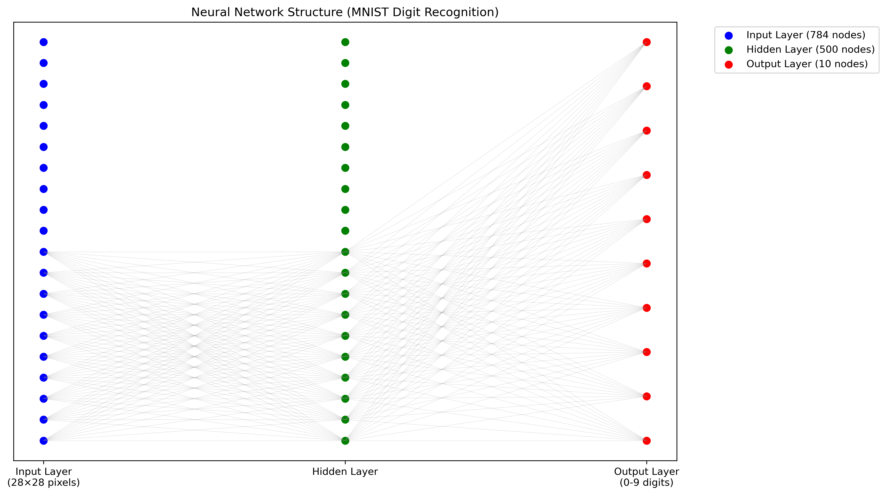
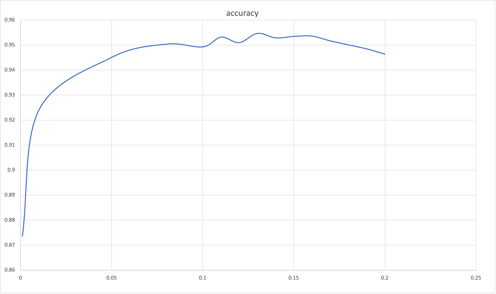

# MNIST手写数字识别神经网络

## 项目概述
该项目实现了一个基于神经网络的MNIST手写数字识别系统，支持模型训练、测试以及学习率参数优化。项目使用numpy进行矩阵运算，通过反向传播算法训练神经网络，并能保存/加载模型权重以复用训练成果。

## 神经网络模型架构
本项目实现了一个具有一个隐藏层的前馈神经网络（Feedforward Neural Network），也称为多层感知机（Multilayer Perceptron, MLP）。

### 模型结构
这是一个经典的三层神经网络结构：输入层、隐藏层和输出层。

<div align="center">
  
</div>

**模型特点：**
- **输入层**：784个节点（对应28×28像素的MNIST图像）
- **隐藏层**：500个节点（可调节）
- **输出层**：10个节点（对应0-9数字分类）
- **激活函数**：使用Sigmoid函数进行非线性变换
- **训练算法**：反向传播算法（Backpropagation）

## 项目结构
```plainText
PythonProject/
├── model/
│   └── NeuralNetwork.py    # 神经网络核心实现
├── train/
│   └── train_NeuralNetwork.py  # 模型训练脚本
├── test/
│   └── test_NeuralNetwork.py   # 模型测试与评估脚本
├── models/                  # 保存训练好的模型权重
├── result/
│   └── accuracy.png         # 准确率可视化结果
└── main.py                  # 项目入口文件
```
## 环境要求
- Python 3.x
- numpy
- scipy

## 安装说明
1. 克隆仓库到本地
2. 安装依赖包：
```bash
pip install numpy scipy
```
3. 准备MNIST数据集并修改代码中的数据路径

## 使用方法

### 基本训练与测试
```python
# 训练模型
from train.train_NeuralNetwork import train_neural_network
train_neural_network(input_nodes=784, hidden_nodes=500, output_nodes=10, learning_rate=0.1, file_prefix='nn_weights')

# 测试模型
from test.test_NeuralNetwork import test_neural_network
test_neural_network()
```

### 学习率优化
项目支持自动测试多个学习率并找出最优值：
```python
from test.test_NeuralNetwork import run_experiments
run_experiments()  # 测试预设范围内的学习率并输出准确率
```

## 神经网络参数
- `input_nodes`: 输入节点数，默认为784（对应28x28像素图像）
- `hidden_nodes`: 隐藏层节点数，默认为500
- `output_nodes`: 输出节点数，默认为10（对应0-9数字）
- `learning_rate`: 学习率，可通过实验找到最优值
- `epochs`: 训练轮数，默认为5轮

## 模型保存与加载
```python
# 保存模型
nn = NeuralNetwork(784, 500, 10, 0.1)
nn.save_model('my_model')

# 加载模型
nn.load_weights('models/my_model_wih.npy', 'models/my_model_who.npy')
```

## 实验结果
项目包含学习率搜索功能，可自动测试不同学习率对应的模型准确率。典型学习率测试范围为0.001至0.2，测试结果将显示各学习率对应的准确率并标记最佳结果。

<div align="center">
  
</div>

## 代码示例
### 创建神经网络并训练
```python
from model.NeuralNetwork import NeuralNetwork

# 创建神经网络实例
nn = NeuralNetwork(input_nodes=784, hidden_nodes=500, output_nodes=10, learning_rate=0.1)

# 训练模型
nn.train(inputs_list, targets_list)

# 查询结果
result = nn.query(inputs_list)
```
